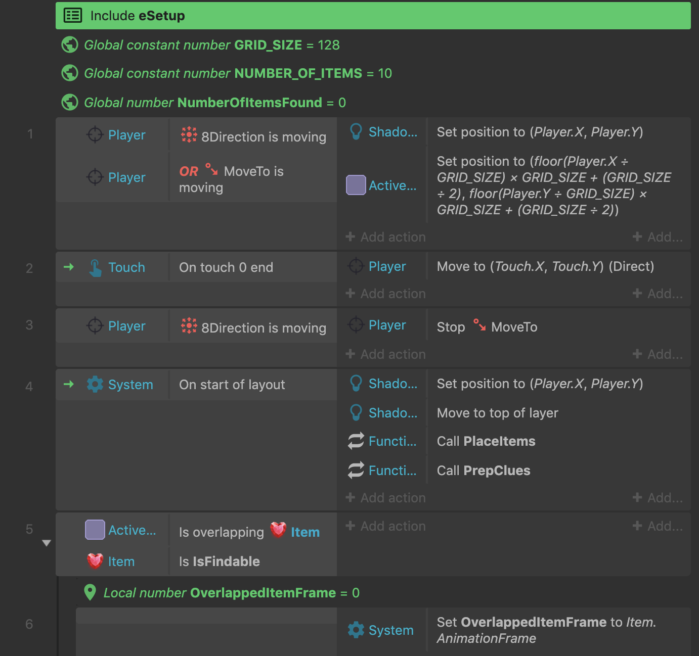

# My Construct 3 Games Monorepo

Note: these games were all created using Construct 3. The code isn't really meant to be human-readable, but rather to be opened in the visual editor. You can open the projects by visiting the [Construct editor](https://editor.construct.net/). You will need a Chromium browser (Chrome, latest Edge, etc.) to view them because I'm using [folder-based saves](https://www.construct.net/en/blogs/construct-official-blog-1/local-file-folder-saves-1555). Since I'm using the paid version of Construct and often surpassing the limits of the free version, you may not be able to make certain changes to the code if you're using the free version.

## BattlelandsRL

A flip screen roguelite made for [7DRL 2021](https://itch.io/jam/7drl-challenge-2021)

* Folder: [/battlelands](./battlelands)
* [Play on Itch](https://mapsandapps.itch.io/battlelandsrl)

## Void Scavenge

A hidden object maze made for [Eggplant Podcast Community Game Jam #1: "Going into the Void"](https://itch.io/jam/eggplant-podcast-community-game-jam/rate/930398)

* Folder: [/void-scavenge](./void-scavenge)
* [Play on Itch](https://mapsandapps.itch.io/void-scavenge)

## Thumb War

2-player couch game made for [Weekly Game Jam #184: "Thumb War"](https://itch.io/jam/weekly-game-jam-184/rate/885129) in January 2021

* Folder: [/thumb-war](./thumb-war)
* [Play on Itch](https://mapsandapps.itch.io/thumb-war)

## Sandwiches

Puzzle game prototype started in November 2020

* Folder: [/sandwich](./sandwich)

## Solitaire Collection

Started in November 2020

* Folder: [/solitaire-collection](./solitaire-collection)

## Hidden Object

A simple hidden object game made for [Weekly Game Jam #169: "Treasure Hunt"](https://itch.io/jam/weekly-game-jam-169/rate/782763) in October 2020

* Folder: [/hidden-object](./hidden-object)
* [Play on Itch](https://mapsandapps.itch.io/hidden-object)

## Labyrinth Desktop

A not-a-game game, keyboard-controlled version

* Folder: [/labyrinth-desktop](./labyrinth-desktop)

## Labyrinth Mobile

A not-a-game game, mobile version

Started in September 2020

* Folder: [/labyrinth-mobile](./labyrinth-mobile)

## Gems!

Arcade game made for [Weekly Game Jam #165: "One Button Mash"](https://itch.io/jam/weekly-game-jam-165/rate/750744) in September 2020

* Folder: [/find-gems](./find-gems)
* [Play on Itch](https://mapsandapps.itch.io/gems)

## Mirror Dice

Roll & write game made for [Weekly Game Jam #148: "Mirror"](https://itch.io/jam/weekly-game-jam-148/rate/642444) in May 2020

* Folder: [/mirror-dice](./mirror-dice)
* [Play on Itch](https://mapsandapps.itch.io/mirror-dice)

## Hidden Column

Solitaire card game made for [Weekly Game Jam #147: "Invisible"](https://itch.io/jam/weekly-game-jam-147/rate/634771) in May 2020

* Folder: [/hidden-column](./hidden-column)
* [Play on Itch](https://mapsandapps.itch.io/hidden-column)

## Rafting

Endless rafter plus zen mode made for [Weekly Game Jam #143: "Running Water"](https://itch.io/jam/weekly-game-jam-143/rate/605798) in April 2020

* Folder: [/rafting](./rafting)
* [Play on Itch](https://mapsandapps.itch.io/rafting)

## War

Classic card game made for [Weekly Game Jam #141: "Good Luck"](https://itch.io/jam/weekly-game-jam-141/rate/593415) in March 2020

* Folder: [/war](./war)
* [Play on Itch](https://mapsandapps.itch.io/war)

## Ocean Charting RL

Ocean exploration game made for 7DRL 2020 in February-March 2020 (incomplete)

* Folder: [/ocean-charting-roguelike](./ocean-charting-roguelike)
* [Play on Itch](https://mapsandapps.itch.io/ocean-charting-rl)

## Napoleon's Square

My rendition of a classic solitaire game, started in February 2020

* Folder: [/napoleon](./napoleon)
* [Play on Itch](https://mapsandapps.itch.io/napoleons-square)

## Robot Co-op

Puzzle Game made for [Weekly Game Jam #136: "Single Player Co-op"](https://itch.io/jam/weekly-game-jam-136) in February 2020

* Folder: [/co-op](./co-op)
* [Play on Itch](https://mapsandapps.itch.io/robot-co-op)

## Truchet Tiles playground

Inspired by [https://www.reddit.com/r/blender/comments/ezrlen/animated_truchet_tiles/](https://www.reddit.com/r/blender/comments/ezrlen/animated_truchet_tiles/)

Started in February 2020

* Folder: [/truchet](./truchet)
* [View on Itch](https://mapsandapps.itch.io/truchet-tiles)

## Magnets

Puzzle Game made for [Weekly Game Jam #134: "Magnet"](https://itch.io/jam/weekly-game-jam-134) in January-February 2020

Collaboration with [Imperial R.J.](https://soundcloud.com/mperial17/castler) (music & SFX)

* Folder: [/magnet](./magnet)
* [Play on Itch](https://mapsandapps.itch.io/magnets)

## Spelling with the Fishes

Word game created for [Weekly Game Jam #132: "Deep Dive"](https://itch.io/jam/weekly-game-jam-132) in January 2020

* Folder: [/word-fishing](./word-fishing)
* [Play on Itch](https://mapsandapps.itch.io/spelling-with-the-fishes)

## Color Filter Solitaire

Solitaire card game started for [Weekly Game Jam #131: "Magic Mask"](https://itch.io/jam/weekly-game-jam-131) in January 2020

* Folder: [/color-filter-solitaire](./color-filter-solitaire)
* [Read instructions on Itch](https://mapsandapps.itch.io/color-filter-solitaire)

## You Only Get One

Math game built for [Construct 3 Builder Jam #1: "You Only Get One"](https://itch.io/jam/construct3-builder-jam-1) in January 2020

* Folder: [/you-only-get-one](./you-only-get-one)
* [Play on Itch](https://mapsandapps.itch.io/you-only-get-one)

## Labyrinth

A not-a-game game

Construct 3 version started in January 2020

* Folder: [/labyrinth](./labyrinth)

## Lost in (3D) Space

3D maze game made for [Weekly Game Jam #129: "Lost in Space"](https://itch.io/jam/weekly-game-jam-129) in December 2019

* Folder: [/3d-maze](./3d-maze)
* [Play on Itch](https://mapsandapps.itch.io/lost-in-3d-space)

## Paint It Black

Color-based puzzler made for [Weekly Game Jam #128: "Camouflage"](https://itch.io/jam/weekly-game-jam-128) in December 2019

* Folder: [/camouflage](./camouflage)
* [Play on Itch](https://mapsandapps.itch.io/paint-it-black)

## Various other tests, false starts, prototypes, etc.

Check out the other folders

Also check out [/utils](./utils) for some helper methods, etc. to be used across games

# Credits

* Assets
  * Audio, art assets, and fonts from [Kenney](https://kenney.nl/assets) (CC0 1.0 Universal)
  * Some art by [me](https://github.com/mapsandapps)
  * Art from the [2D Game Art Bundle](https://www.gamedevmarket.net/asset/2d-game-art-bundle-2018/) (purchased in the Humble 2D Game Dev Bundle)
  * [8-ball pool assets](https://opengameart.org/content/8-ball-pool-assets) (CC0)
  * Music & sound effects by [Imperial R.J.](https://soundcloud.com/mperial17/castler)
  * ["sidebyside" by panu](http://ccmixter.org/files/panumoon/61111) (CC BY-NC 3.0)
  * ["Silence of the Machines" composed by onemansymphony.bandcamp.com](https://onemansymphony.bandcamp.com) (CC BY 4.0)
  * [Humble 7000 Game Dev Icons Bundle](https://www.humblebundle.com/software/7000-game-dev-icons-software) (purchased)
  * [Heroic UI](https://assetstore.unity.com/packages/2d/gui/icons/heroic-ui-106778#description) by [Rexard](https://assetstore.unity.com/publishers/13229) (purchased)
  * [Humble Game Dev Map & Level Creator Bundle](https://www.humblebundle.com/software/game-dev-map-level-creator-software) (purchased)
  * [Hand Painted Tiling Textures by beefpuppy](https://beefpuppy.itch.io/hptt) (purchased, CC BY 4.0)
* Code
  * Word list from [David Ruffner](https://github.com/davidruffner/scrabble-word-finder/blob/master/resources/enable1-wwf-v4.0-wordlist.txt) (MIT license)
  * [BigEval](https://github.com/aviaryan/bigEval.js) (Apache-2.0)
  * [Fantasy Map Generator](https://github.com/Azgaar/Fantasy-Map-Generator) (MIT license)
  * [Rough.js](https://roughjs.com/) (MIT license)
  * [Random flip screen dungeon layouts by me](https://codepen.io/mapsandapps/pen/YzpGZQM) (MIT license)
* Fonts
  * [Cookie](https://fonts.google.com/specimen/Cookie) (Open Font License)
  * [Jost](https://fonts.google.com/specimen/Jost) (Open Font License)
  * [League Spartan](https://www.theleagueofmoveabletype.com/league-spartan) (Open Font License)
  * [Metamorphous](https://fonts.google.com/specimen/Metamorphous) (Open Font License)
  * [Montserrat](https://fonts.google.com/specimen/Montserrat) (Open Font License)
  * [Odibee Sans](https://fonts.google.com/specimen/Odibee+Sans) (Open Font License)
  * [Oswald](https://fonts.google.com/specimen/Oswald) (Open Font License)
  * [Poppins](https://fonts.google.com/specimen/Poppins) (Open Font License)
  * [Righteous](https://fonts.google.com/specimen/Righteous) (Open Font License)
  * [Roboto](https://fonts.google.com/specimen/Roboto) (Open Font License)
  * [Sigmar One](https://fonts.google.com/specimen/Sigmar+One) (Open Font License)
  * [Yusei Magic](https://fonts.google.com/specimen/Yusei+Magic) by Tanukizamurai (Open Font License)
